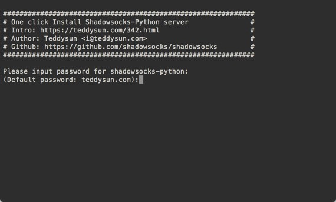
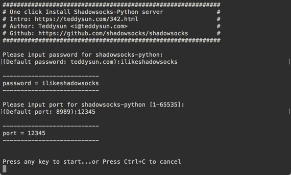

## How to deploy a shadowsocks server on a Vultr VPS [Back](./qa.md)

### 1. Install Shadowsocks via script

Here we are going to use the script of [teddysun](https://teddysun.com/342.html) to install servers of Shadowsocks on the Vultr VPS server automatically:

At first, download the script:

```bash
wget --no-check-certificate https://raw.githubusercontent.com/teddysun/shadowsocks_install/master/shadowsocks.sh
chmod +x shadowsocks.sh
```

Then change mode of this file to give it privilege to run:

```bash
chmod +x shadowsocks.sh
```

Finally run it:

```bash
./shadowsocks.sh 2>&1 | tee shadowsocks.log
```

### 2. Set the password



### 3. Set the port



### 4. TCP Fast Open

To enhance the speed of connection, you can do more with followed steps:

1. Add the followed line into the file `/etc/rc.local`:
    ```bash
    #/etc/rc.local
    echo 3 > /proc/sys/net/ipv4/tcp_fastopen
    ```
2. Add the followed line into the file `/etc/sysctl.conf`:
    ```bash
    # /etc/sysctl.conf
    net.ipv4.tcp_fastopen = 3
    ```
3. Modified the attribute `fast_open` with `true` in the file `/etc/shadowsocks.json`
4. Restart the server of Shadowsocks:
    ```bash
    
    ```


